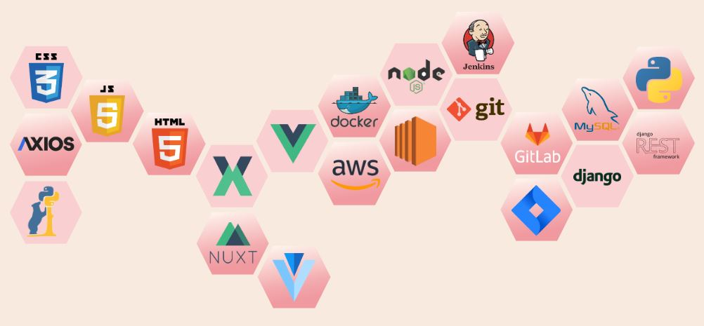

# 어린이ZIP

> 특화-Sub PJT 3
>
> 2020.09.21~2020.10.08(총 3주)

| 이름         | 역할                                   |
| ------------ | -------------------------------------- |
| 김명석(팀장) | Frontend Develop                       |
| 서용준       | Backend Develop                        |
| 서지훈       | Frontend Develop                       |
| 안성민       | Fullstack Develop, 데이터 수집 및 정제 |
| 허예슬       | Backend Develop                        |

<br><br>


<br>


### 서비스 개요 

`어린이zip`은 어린이집 데이터를 기반으로 사용자의 니즈와 기호를 반영해 어린이집을 추천해주는 웹 애플리케이션(web application)입니다. 


### 개발 동기

> 어린 자녀를 둔 부모님과의 인터뷰를 통해 어린이집을 선택할 때 일반적으로 지인의 추천 혹은 네이버 카페 등을 이용해 정보를 탐색하지만 그 과정에서 많은 정보가 퍼져있어 곤혹을 겪는다는 사실을 알게되었습니다. 
>
> 어린이집 정보를 한 눈에 볼 수 있고, 또 자녀에게 꼭 맞는 어린이집을 추천해줌으로써 부모님들이 어린이집을 탐색할 때 느끼는 피곤함을 덜 수 있지 않을까? 라는 생각으로 프로젝트를 기획하였습니다. 
>


### 주요 기능

- 전국 어린이집 조회 
  - 필터 기능 
  - 어린이집 찜 기능
- 어린이집 추천
  - 사용자가 입력 및 클릭한 데이터를 바탕으로 비슷한 어린이집 추천 
- 커뮤니티
  - 원하는 게시판 생성 기능
  - 게시판 즐겨찾기  
- 원장과 원격 화상 상담 


- 어린이집 정보와 더불어 지역구별 인구당 범죄 발생 빈도 & 강력 범죄 비율 시각화
- 어린이집 리뷰 데이터를 기반으로 어린이집 추천 

<br><br>
[](http://childrenzip.site/)를 클릭해 사이트를 확인하세요! 😊

### 사용 기술

```
DB : MySQL
Language : Python, JavaScript
Browser : Chrome
FrameWork : Django, Vue, Nuxt
ETC : Docker
```


### ERD


[ERD Diagram](https://www.erdcloud.com/d/a36xRNx6woXE7ukPk)

<br><br>

### 사용된 도구
- npx 6.14.5
- nuxt.js 2.14.6
- Django 3.12.0
- IDE: Visual Studio Code 1.48



<br><br>
