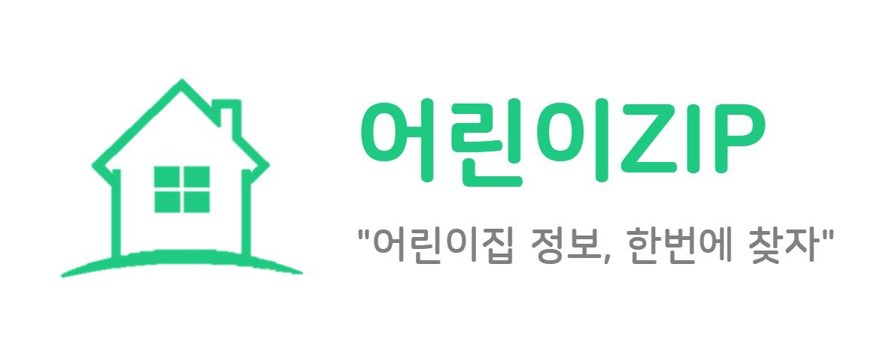
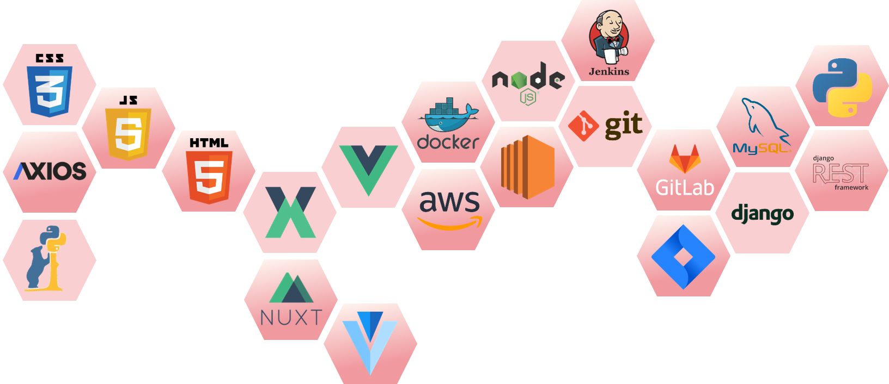
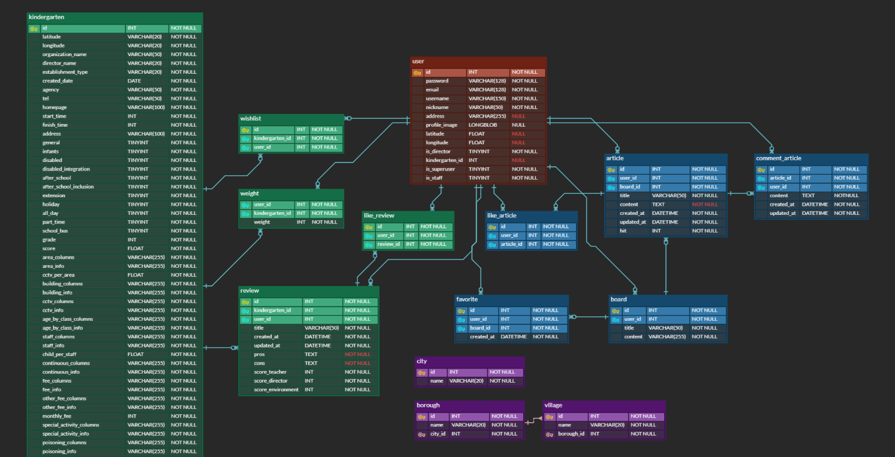

[](http://childrenzip.site)


<br>

### Translation: [US](#) [KR](https://github.com/msnodeve/Children-ZIP)

<br>

## 🏠 Daycare center recommendation platform, Children-ZIP

`Children-ZIP` is a web application that recommends a daycare center suitable for users.

Based on the user's location and activity within the website

It recommends daycare centers in a way that combines Content-Based Filtering and User-Based Collaborative Filtering techniques.

Click [here](http://childrenzip.site/) to check the site 🙂

<br>

### Motive

> Through interviews with parents with young children, I learned that when choosing a daycare center, people generally search for information using recommendations from acquaintances or Naver Cafe, but in the process, a lot of information is spread out, which makes them confused.
>
> The project was planned with the hope that parents would be able to see information about daycare centers at a glance, and that they would be able to alleviate the tiredness of exploring daycare centers by recommending centers to parents.

<br>

<br>

## 📌 Table of Contents

- [🏠 Daycare center recommendation platform, Children-ZIP](#-daycare-center-recommendation-platform-children-zip)
  - [Motive](#motive)
- [📌 Table of Contents](#-table-of-contents)
- [🔨 Tech Stacks](#-tech-stacks)
- [🧱 Project Structure](#-project-structure)
- [📜 ERD](#-erd)
- [🔍 Project Process](#-project-process)
- [✅ Main Function](#-main-function)
- [🎥 Demonstration](#-demonstration)
- [🌏 Browsers Supported](#-browsers-supported)
- [👩‍💻 Developers](#-developers)
- [🔗 References](#-references)

<br>

<br>

## 🔨 Tech Stacks



<br>

<br>

## 🧱 Project Structure

```
.
├── .gitignore # Files that specify a list of files to exclude from Git version management
├── README.md
├── img # Related images folder
├── members_docs # Documentation for team members
├── frontend
│   ├── assets # Uncomplied resource related folders such as style, image, and font
│   ├── pages # Includes application views and paths(routing)
│   │   ├── board # Related board pages
│   │   ├── community # Related community pages
│   │   ├── kinder # Related children and kindergarten pages
│   │   ├── signup # Related account pages
│   │   └── ... # Each page to be routed
│   ├── static # Static files do not change(favicon, robots.txt, sitemap.xml etc.)
│   ├── nuxt.config.js # config file for nuxt.js
│   ├── package.json # Dependencies and scripting
│   ├── layouts # Need to repeat the fixed layout on each page and put it in.
│   └── components # Nust.js scanned and automatically imported
│       ├── Common # Related Header, Footer, Common commponents UI
│       ├── Community # Related community UI
│       ├── Home # Related main UI
│       ├── Kinder # Related children, kindergarten UI
│       ├── Launcher # 런처페이지 Related launcher UI
│       └── Search # 검색 관련 Related search UI
└── backend
    ├── account # Account API
    ├── community # Board API
    ├── kindergartens # Kindergarten API
    ├── spc_pjt # Django setup file
    ├── templates
    ├── Dockerfile # Image file for containerizing Django
    ├── manage.py # Django run file
    ├── requirements.txt # dependency management
    └── bigdata
        ├── analyze.py # Formatting and saving infomation on the crawling kindergarten data
    	├── crawling.py # Code for crawling kindergarten data
    	├── recommend.py # Code for applying recommended algorithm
    	└── requriements.txt # dependency management
```

<br>

<br>

## 📜 ERD



[ERD Diagram link](https://www.erdcloud.com/d/a36xRNx6woXE7ukPk)

<br>

<br>

## 🔍 Project Process


<br>

<br>

## ✅ Main Function

- Recommended Daycare centers

  - Recommendation system based on user's preferred feature analysis and user's activity analysis
  - Filtering

   

- Searching national Daycare centers

  - Bookmark
  - Visualization of information such as average number of years of service for teachers, number of infants per teacher, and number of CCTVs per 100m²
  - Write and view ratings and reviews of Daycare center

   

- Community

  - Search and create the desired board

   

  - Add and delete posts and comments

   

<br>

<br>

## 🎥 Demonstration

[](https://youtu.be/qOEFXODnMOA)

<br>

<br>

## 🌏 Browsers Supported

|  |  |  |  |
| :----------------------------------------------------------: | :----------------------------------------------------------: | :----------------------------------------------------------: | :----------------------------------------------------------: |
|                            latest                            |                            latest                            |                            latest                            |                            latest                            |

<br>

<br>

## 👩‍💻 Developers

- MyeongSeok KIM (https://github.com/msnodeve)
- Yeseul Heo (https://github.com/yeseul4072)
- Jihoon Seo (https://github.com/sjh7141)
- SungMin Ahn (https://github.com/asm9677)
- Yongjoon Seo (https://github.com/YongjoonSeo)

<br>

<br>

## 🔗 References

- [Our Development Story](https://www.notion.so/msnodeve/GG-ZIP-4755010382c943ec9444ecdb22ea01c5)