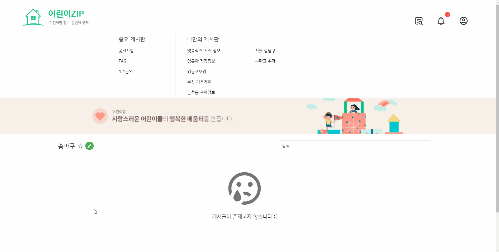

### Main function

- Recommended Daycare centers
   - Recommendation system based on user's preferred feature analysis and user's activity analysis
   - Filtering
   # 

- Searching national Daycare centers
   - Bookmark
   - Visualization of information such as average number of years of service for teachers, number of infants per teacher, and number of CCTVs per 100m²
   - Write and view ratings and reviews of Daycare center
   # 

- Community
   - Search and create the desired board
   # 
   - Add and delete posts and comments
   # 

### Demo video
