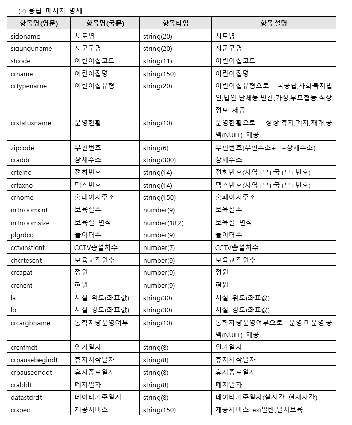
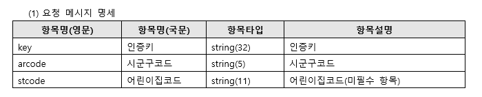

# Docs

key : c328539d552b4533859d6ee8d1284221

url : [http://api.childcare.go.kr/mediate/rest/cpmsapi030/cpmsapi030/request](http://api.childcare.go.kr/mediate/rest/cpmsapi030/cpmsapi030/request)

[http://api.childcare.go.kr/mediate/rest/cpmsapi030/cpmsapi030/request?key=c328539d552b4533859d6ee8d1284221&arcode=11380](http://api.childcare.go.kr/mediate/rest/cpmsapi030/cpmsapi030/request?key=c328539d552b4533859d6ee8d1284221&arcode=11380)

### 어린이집 API 기본 명세서

[어린이집 기본정보 조회.doc](resource/__.doc)

- 대충 이런식으로 넘어옴

    ```json
    <response>
    	  <item>
    			    <sidoname>서울특별시</sidoname>
    			    <sigunguname>송파구</sigunguname>
    			    <stcode>11620000341</stcode>
    			    <crname>1111어린이집</crname>
    			    <crtypename>가정</crtypename>
    			    <crstatusname>정상</crstatusname>
    			    <zipcode>151770</zipcode>
    			    <craddr>서울특별시 송파구 송파대로39길 94</craddr>
    			    <crtelno>02-1111-2222</crtelno>
    			    <crfaxno>02-1111-3333</crfaxno>
    			    <crhome>http://cafe.daum.net/1111child</crhome>
    			    <nrtrroomcnt>5</nrtrroomcnt>
    			    <nrtrroomsize>193</nrtrroomsize>
    			    <plgrdco>3</plgrdco>
    			<cctvinstlcnt>7</cctvinstlcnt>
    			    <chcrtescnt>2</chcrtescnt>
    			    <crcapat>18</crcapat>
    			    <crchcnt>17</crchcnt>
    			    <la>47.59452212</la>
    			    <lo>137.0643009</lo>
    			    <crcargbname>운영</crcargbname>
    			<crcnfmdt>2007-01-10</crcnfmdt>
    			<crpausebegindt></crpausebegindt>
    			<crpauseenddt></crpauseenddt>
    			<crabldt></crabldt>
    			<datastdrdt>2019-04-01</datastdrdt>
    			<crspec>시간연장형,일시보육</crspec>
    	  </item>
    	  <item>
    	    <sidoname>전라북도</sidoname>
    	    <sigunguname>전주시 완산구</sigunguname>
    	    <stcode>11200000040</stcode>
    	    <crname>2222어린이집</crname>
    	    <crtypename>민간</crtypename>
    	    <crstatusname>폐지</crstatusname>
    	    <zipcode>55088</zipcode>
    	    <craddr>전라북도 전주시 완산구 하거마7길 18 (삼천동1가)</craddr>
    	    <crtelno>063-2222-2222</crtelno>
    	    <crfaxno>063-2222-3333</crfaxno>
    	    <crhome>http://cafe.daum.net/2222child</crhome>
    	    <nrtrroomcnt>3</nrtrroomcnt>
    	    <nrtrroomsize>85</nrtrroomsize>
    	    <plgrdco>0</plgrdco>
    	    <cctvinstlcnt>21</cctvinstlcnt>
    	    <chcrtescnt>3</chcrtescnt>
    	    <crcapat>7</crcapat>
    	    <crchcnt>7</crchcnt>
    	    <la>39.79626769</la>
    	    <lo>129.1250128</lo>
    	    <crcargbname>미운영</crcargbname>
    	    <crcnfmdt>2007-05-10</crcnfmdt >
    		<crpausebegindt></crpausebegindt >
    		<crpauseenddt></crpauseenddt>
    		<crabldt>2015-05-04</crabldt>
    		<datastdrdt>2019-04-01</datastdrdt>
    		<crspec>일반</crspec>
    		</item>
    </response>
    ```

- 실제로 넘어오는 데이터

    ```json
    <response>
    	<item>
    		<sidoname>서울특별시</sidoname>
    		<sigunname>은평구</sigunname>
    		<stcode>11380000498</stcode>
    		<crname>가연어린이집</crname>
    		<crtypename>가정</crtypename>
    		<crstatusname>폐지</crstatusname>
    		<zipcode>03356</zipcode>
    		<craddr>서울특별시 은평구 통일로 780 9동 106호(불광동, 미성아파트)</craddr>
    		<crtelno>02-355-7210</crtelno>
    		<crfaxno/>
    		<crhome/>
    		<nrtrroomcnt>3</nrtrroomcnt>
    		<nrtrroomsize>49</nrtrroomsize>
    		<plgrdco>0</plgrdco>
    		<cctvinstlcnt>3</cctvinstlcnt>
    		<chcrtescnt>0</chcrtescnt>
    		<crcapat>18</crcapat>
    		<crchcnt>0</crchcnt>
    		<la>37.61464782</la>
    		<lo>126.9282017</lo>
    		<crcargbname>미운영</crcargbname>
    		<crcnfmdt>2010-06-10</crcnfmdt>
    		<crpausebegindt/>
    		<crpauseenddt/>
    		<crabldt>2018-09-10</crabldt>
    		<datastdrdt>2020-09-07</datastdrdt>
    		<crspec>일반</crspec>
    	</item>
    </response>
    ```






## `필터링 할 특징`

설립유형

설립(개원)일

지도(center) 주소

운영시간

제공 서비스 (10개)

CCTV 유무? 개수?

통학차량운영

특별활동

평가등급

연장보육반 운영 여부

회비(경비합치기)

# 와이어프레임 설계 전 페이지 구성

## 헤더

- 로그인
- 로그아웃
- 회원가입
- 내 정보
- 메인 버튼(로고)
- 검색창
- 메뉴 버튼

## 푸터

- Copyright
- Contact

## 회원가입 페이지

- 

## 메인 페이지

- 

## 어린이집에 대한 상세 정보 페이지

- API에서 들고온 데이터를 출력해주고
- 리뷰 데이터도 출력해주고
- 커뮤니티에 연관된 게시글도 출력해주고
- 시각화 UI/UX에 대해 깊은 고민이 필요